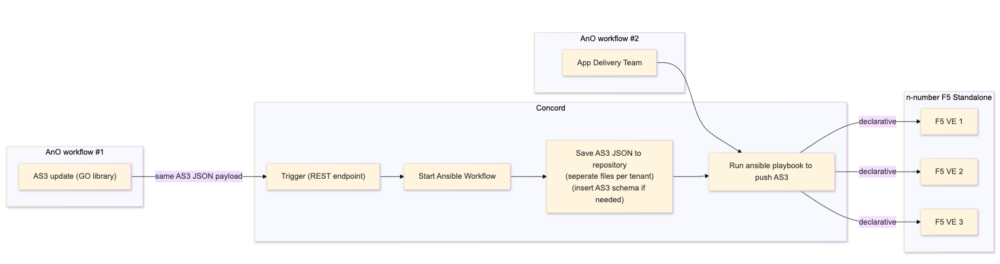
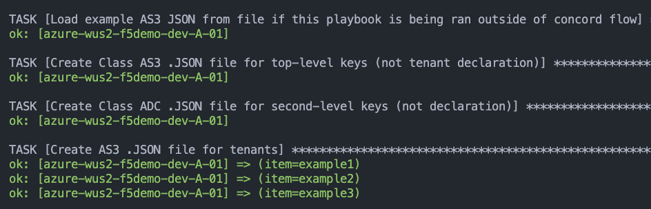
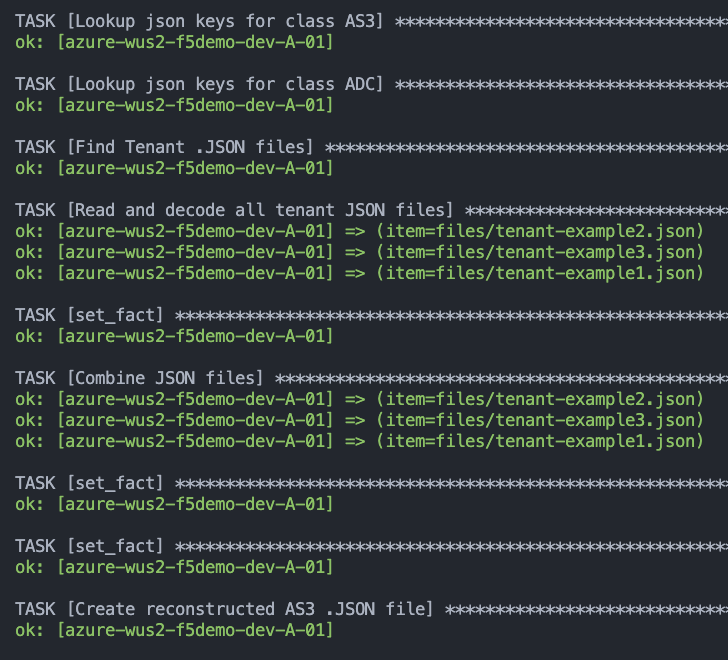
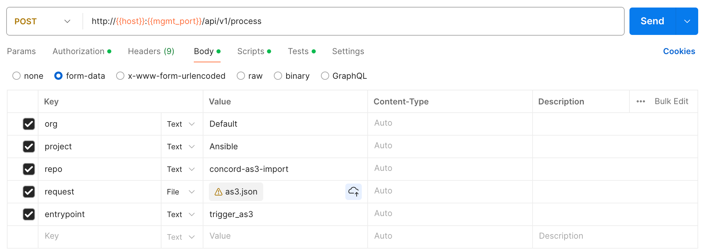
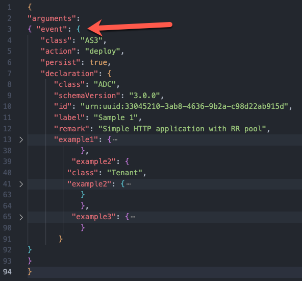

# concord-as3-import



### Features

Parse the AS3 JSON with n-number tenants into n-number JSON files with trigger_as3.yml playbook:

Example output using example-AS3.json:
```bash
files/
├── class-adc-keys.json     # All JSON keys at class ADC
├── class-as3-keys.json     # All JSON keys at class AS3          
├── tenant-example1.json    # All JSON keys for tenant example1
├── tenant-example2.json    # All JSON keys for tenant example1
└── tenant-example3.json    # All JSON keys for tenant example1
```

Example Contents:
```
$ head -5 * 
==> class-adc-keys.json <==
{
    "class": "ADC",
    "id": "urn:uuid:33045210-3ab8-4636-9b2a-c98d22ab915d",
    "label": "Sample 1",
    "remark": "Simple HTTP application with RR pool",

==> class-as3-keys.json <==
{
    "action": "deploy",
    "class": "AS3",
    "persist": true
}
==> tenant-example1.json <==
{
    "example1": {
        "class": "Tenant",
        "example1": {
            "class": "Application",

==> tenant-example2.json <==
{
    "example2": {
        "class": "Tenant",
        "example2": {
            "class": "Application",

==> tenant-example3.json <==
{
    "example3": {
        "class": "Tenant",
        "example3": {
            "class": "Application",
```

The ansible playbook update_as3.yml can reconstitute the original AS3 JSON payload:


Example output:
```bash
files/
files/
├── class-adc-keys.json     # All JSON keys at class ADC
├── class-as3-keys.json     # All JSON keys at class AS3          
├── tenant-example1.json    # All JSON keys for tenant example1
├── tenant-example2.json    # All JSON keys for tenant example1
├── tenant-example3.json    # All JSON keys for tenant example1
└── declaration.json        # Reconstituted AS3 JSON payload from all files above 
```
Example contents of declaration.json:
```
$ jq keys files/declaration.json 
[
  "action",
  "class",
  "declaration",
  "persist"
]

$ jq '.declaration | keys[]' files/declaration.jso
n 
"class"
"example1"
"example2"
"example3"
"id"
"label"
"remark"
"schemaVersion"
```

### Example calling Concord Proccess with AS3 payload


Subtitute your values for:
```
org: "Default"
project: "Ansible"
repo: "concord-as3-import"
request: @file.json
entrypoint: "trigger_as3"
```

In order to pass the AS3 declaration to ansible via the Concord Proccess using this flow, add the `argument` and `event` keys to your AS3 JSON file:
 

### Example calling Concord Trigger with AS3 payload

`POST http://concord:8001/api/v1/events/declare`

Request:
```
POST /api/v1/events/declare HTTP/1.1
Content-Type: application/json
Authorization: REDACTED
User-Agent: PostmanRuntime/7.39.0
Accept: */*
Postman-Token: REDACTED
Host: concord:8001
Accept-Encoding: gzip, deflate, br
Connection: keep-alive
Content-Length: 2384
```

POST Body:
```json
{
"class": "AS3",
"action": "deploy",
"persist": true,
"declaration": {
"class": "ADC",
"schemaVersion": "3.0.0",
"id": "urn:uuid:33045210-3ab8-4636-9b2a-c98d22ab915d",
"label": "Sample 1",
"remark": "Simple HTTP application with RR pool",
"example1": {
"class": "Tenant",
"example1": {
"class": "Application",
"example1": {
"class": "Service_HTTP",
"virtualAddresses": [
"10.0.1.10"
],
"pool": "web_pool1"
},
"web_pool1": {
"class": "Pool",
"monitors": [
"http"
],
"members": [{
"servicePort": 80,
"serverAddresses": [
"192.0.1.10",
"192.0.1.11"
]
}]
}
}
},
"example2": {
"class": "Tenant",
"example2": {
"class": "Application",
"example2": {
"class": "Service_HTTP",
"virtualAddresses": [
"10.0.1.11"
],
"pool": "web_pool2"
},
"web_pool2": {
"class": "Pool",
"monitors": [
"http"
],
"members": [{
"servicePort": 80,
"serverAddresses": [
"192.0.2.10",
"192.0.2.11"
]
}]
}
}
},
"example3": {
"class": "Tenant",
"example3": {
"class": "Application",
"example3": {
"class": "Service_HTTP",
"virtualAddresses": [
"10.0.1.12"
],
"pool": "web_pool3"
},
"web_pool3": {
"class": "Pool",
"monitors": [
"http"
],
"members": [{
"servicePort": 80,
"serverAddresses": [
"192.0.3.10",
"192.0.3.11"
]
}]
}
}
}
}
}
```

HTTP Response from concord:
```
HTTP/1.1 200 OK
Date: Tue, 20 Aug 2024 15:03:22 GMT
Access-Control-Allow-Origin: *
Access-Control-Allow-Methods: *
Access-Control-Allow-Headers: Authorization, Content-Type, Range, Cookie, Origin
Access-Control-Expose-Headers: cache-control,content-language,expires,last-modified,content-range,content-length,accept-ranges
Cache-Control: no-cache, no-store, must-revalidate
Pragma: no-cache
Expires: 0
Set-Cookie: rememberMe=deleteMe; Path=/; Max-Age=0; Expires=Mon, 19-Aug-2024 15:03:22 GMT; SameSite=lax
Content-Length: 0
Server: Jetty(9.4.49.v20220914)
```